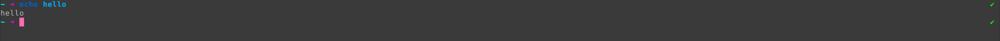

#### crystal
> A theme for [Oh My Fish][omf-link].

[](/LICENSE)
[](https://fishshell.com)
[](https://www.github.com/oh-my-fish/oh-my-fish)

<br/>


## Install

```fish
$ omf install crystal
```


## Features

* Path | Git status | ... | ✔︎ / ✗ $status


## Screenshot

<p align="center">

</p>


# License

[MIT][mit] © [chris-vest][author] et [al][contributors]


[mit]:            https://opensource.org/licenses/MIT
[author]:         https://github.com/chris-vest
[contributors]:   https://github.com/chris-vest/theme-crystal/graphs/contributors
[omf-link]:       https://www.github.com/oh-my-fish/oh-my-fish

[license-badge]:  https://img.shields.io/badge/license-MIT-007EC7.svg?style=flat-square
